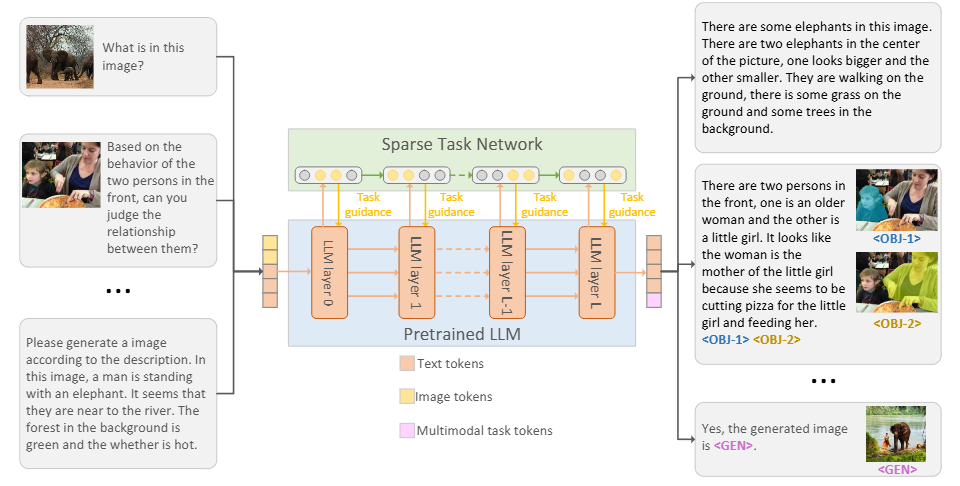
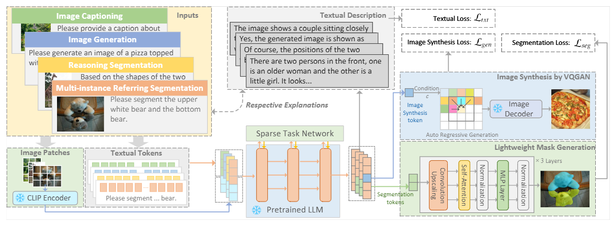
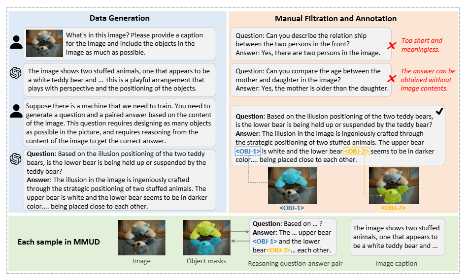

# NeuralTuning

The official **MMUD** datasets and codes for paper "One Framework to Rule Them All: Unifying Multimodal Tasks with LLM Neural-Tuning" in Pattern Recognition

The paper link will be provided later.

## Framework Pipeline

> *Large-scale models have shown impressive abilities across various domains, but most are limited to single-modality data. NeuralTuning addresses this by introducing a unified framework capable of handling multiple tasks and modalities through a consistent token-based approach. Inspired by sparse distributed representation in the human brain, our novel neural tuning strategy enables efficient multitask processing by activating only relevant neuron subsets for each task. We also introduce MMUD, a new benchmark with diverse multimodal and multitask annotations, to advance research in this area. NeuralTuning demonstrates the ability to streamline and unify multimodal, multitask learning using large pretrained models.*

In our proposed framework, we unify all modality inputs into tokens, such as image and textual tokens. After processing, we also introduce some task-specific tokens (e.g., some are for segementation and some are for image generation). We feed the embeddings of these specific tokens to corresponding decoders for downstream tasks.


In our current framework, we integrate four different tasks:
- Reasoning segmentation: Model need to reason contents in the image to segment objects (e.g., *based on contents in the image, who is the mother? (also provide some explainations)*).
- Multi-instance referring segmentation: Model segemets objects according to user instructions (e.g., *please segment the right person in the image.*).
- Image captioning: Model describe the contents in the image in detail.
- Text-to-image generation: Model generates images according to the input prompts.


The all-in-token framework and the training/inference pipeline are shown as (for further detials, please refer to our paper):
<p align="center">
	
</p>
<p align="center">
	<b>Figure 1:</b> Overview of the All-in-Token framework.
</p>

<p align="center">
	
</p>
<p align="center">
	<b>Figure 2:</b> Pipeline of the training and inference process.
</p>


To better tune the model to various downstream tasks, we introduce a new tuning strategy, Neural Tuning. In neural tuning, we introduce a Sparse Tasks Network, which only activates a small part of neurons for different tasks. For each layer, the detailed structure is shown as (for further detials, please refer to our paper):

<p align="center">
	
</p>
<p align="center">
	<b>Figure 3:</b> Sparse task network strategy in each layer.
</p>


## MMUD Dataset 
The MMUD (Multimodal Understanding Dataset) is a large-scale benchmark designed to advance research in multimodal complex reasoning and fine-tuning of large models.
It provides rich annotations that connect images, natural language captions, detailed reasoning text, and fine-grained object-level annotations.

The dataset is split into three partitions:
| Split      | Samples |
| ---------- | ------- |
| Train      | 33,682  |
| Validation | 1,404   |
| Test       | 1,403   |

The MMUD dataset offers several unique advantages for multimodal research. Unlike traditional image–text datasets that only provide captions, MMUD delivers multi-layered annotations that enable fine-grained visual grounding and complex reasoning. Researchers can directly link natural-language mentions in the enriched text to corresponding objects via segmentation masks and bounding boxes, allowing for precise alignment between vision and language. The dataset supports both high-level semantic understanding (via global captions and reasoning) and low-level perception tasks (via object detection and segmentation). By including legacy category labels from established benchmarks like RefCOCO, RefCOCOg, and RefClef, MMUD also facilitates cross-dataset evaluation and transfer learning. These rich, structured annotations make it a powerful resource for training and evaluating multimodal large language models, visual question answering systems, grounded text generation models, and any application requiring joint visual–linguistic comprehension. 

Specifically, this dataset provides image captions, complex question–answer pairs that require reasoning over the image contents, and fine-grained object-level annotations including segmentation masks, bounding boxes, category labels, and textual descriptions of each object. These components are tightly interlinked—mentions in the enriched reasoning text are explicitly tagged and mapped to the corresponding visual regions—allowing for detailed cross-modal alignment. This enables a wide range of tasks, from visual question answering and grounded dialogue generation, to scene understanding, reasoning-based captioning, and multi-object relational analysis. The combination of natural descriptions, complex reasoning text, and precise object annotations makes MMUD a comprehensive resource for developing and evaluating multimodal AI systems capable of deep understanding rather than surface-level pattern matching.

<p align="center">
	
</p>
<p align="center">
	<b>Figure 3:</b> MMUD Dataset Construction Procedure.
</p>

The detailed fields of each sample are shown as follows.

| Field Name | Description |
| ------------------ | ------------------------------------ |
| **image\_path**    | Path to the image file for the sample (e.g., `1603.jpg`).|
| **caption**        | A short natural-language description of the image’s overall content. Example: *"The image shows an indoor setting that appears to be a bustling kitchen or food preparation area..."*|
| **enriched\_text** | A complex reasoning paragraph paired with a **question–answer** format, enriched with **object tags**. The *question* requires multi-step reasoning about the image. The *answer* provides a detailed explanation, with tagged references (`<LCL-i>`) linking to specific objects in the image. Example: *"##Question: How would one effectively utilize the space in this bustling kitchen, considering the placement of the rightmost table and the buffet table near the camera, to streamline the prep and serving process for an upcoming event? ##Answer `<SEP>`To effectively utilize the space... The rightmost table`<LCL-1>`... The buffet table `<LCL-2>`..."*  |
| **sample_texts**       | Original short descriptions of **individual objects** in the image. Example: *"The right table"*, "*The left table*"|
| **sample_masks**       | Segmentation masks for each object (aligned with `sample_texts` and `enriched_text`). |
| **sample_boxs**        | Bounding box coordinates for each object (aligned with `sample_texts` and `enriched_text`). |
| **sample_height**      | Image height in pixels. |
| **sample_width**       | Image width in pixels. |
| **sample_category**    | Category indices for each object (legacy field from RefCOCO, RefCOCOg, and RefClef datasets). |
| **sample_category_text** | Category names for each object (legacy field from RefCOCO, RefCOCOg, and RefClef datasets). |
| **caption_len**        | Length of the caption in tokens (e.g., `122`). |
| **enriched_text_len**  | Length of the enriched text in tokens (e.g., `270`). |
---

<p align="center">
	
</p>
<p align="center">
	<b>Figure 3:</b> MMUD Dataset Construction Pipeline.
</p>

### Data Access
- **Download Link:** [MMUD(Extaction code: gfqd)](https://pan.baidu.com/s/1EcsA3VfkyNcaJZpBnlZX-g?pwd=gfqd) 
- **Dataset Loader Example:** [MMUDDataLoader.py](https://github.com/kiva12138/NeuralTuning/blob/main/MMUDDataLoader.py)

If you have issues downloading or accessing the dataset, please don't hesitate to contact me: ```sunahoxx@zju.edu.cn```. I could sent you the files directly by email.

---

### Example Usage

```python
from MMUDDataLoader import MMUDDataset

dataset = MMUDDataset(split='train', root_dir=r'./MMUD')

image_path, caption, enriched_text, sample_texts, sample_masks, sample_boxs, sample_height, sample_width, sample_category, sample_category_text, caption_len, enriched_text_len = dataset[118]

print(image_path, caption, enriched_text, sample_texts, sample_masks, sample_boxs, sample_height, sample_width, sample_category, sample_category_text, caption_len, enriched_text_len, sep='\n')
```

## Citation

If you use our codes or data, please don't forget to cite our paper:
```
Will be released soon.
```

