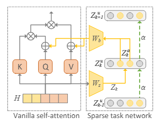

# NeuralTuning

The official **MMUD** datasets and codes for paper "One Framework to Rule Them All: Unifying Multimodal Tasks with LLM Neural-Tuning" in Pattern Recognition

The paper link will be provided later.

## Framework Pipeline

> *Large-scale models have shown impressive abilities across various domains, but most are limited to single-modality data. NeuralTuning addresses this by introducing a unified framework capable of handling multiple tasks and modalities through a consistent token-based approach. Inspired by sparse distributed representation in the human brain, our novel neural tuning strategy enables efficient multitask processing by activating only relevant neuron subsets for each task. We also introduce MMUD, a new benchmark with diverse multimodal and multitask annotations, to advance research in this area. NeuralTuning demonstrates the ability to streamline and unify multimodal, multitask learning using large pretrained models.*

In our proposed framework, we unify all modality inputs into tokens, such as image and textual tokens. After processing, we also introduce some task-specific tokens (e.g., some are for segementation and some are for image generation). We feed the embeddings of these specific tokens to corresponding decoders for downstream tasks.

In our current framework, we integrate four different tasks:
- Reasoning segmentation: Model need to reason contents in the image to segment objects (e.g., *based on contents in the image, who is the mother? (also provide some explainations)*).
- Multi-instance referring segmentation: Model segemets objects according to user instructions (e.g., *please segment the right person in the image.*).
- Image captioning: Model describe the contents in the image in detail.
- Text-to-image generation: Model generates images according to the input prompts.

The all-in-token framework and the training/inference pipeline are shown as (for further detials, please refer to our paper):

	

	<b>Figure 1:</b> Overview of the All-in-Token framework.

	

	<b>Figure 2:</b> Pipeline of the training and inference process.

To better tune the model to various downstream tasks, we introduce a new tuning strategy, Neural Tuning. In neural tuning, we introduce a Sparse Tasks Network, which only activates a small part of neurons for different tasks. For each layer, the detailed structure is shown as (for further detials, please refer to our paper):

	

	<b>Figure 3:</b> Sparse task network strategy in each layer.

## MMUD Dataset 

